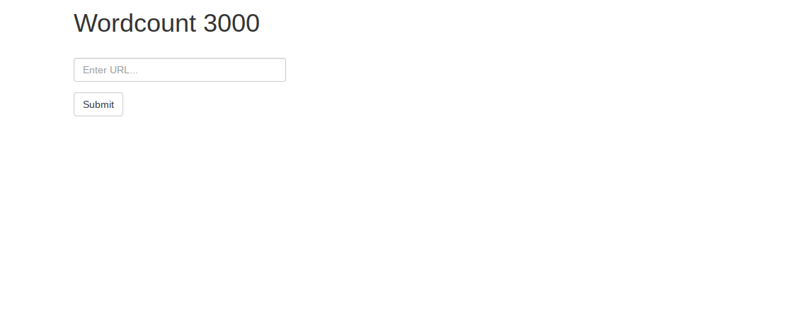
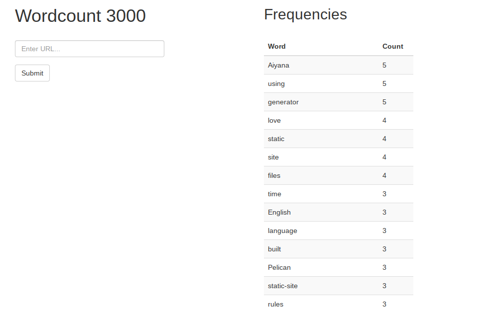

=================
Site Word Counter
=================

:date: 2019-10-31 14:29
:tags: projects, flask, nltk
:category: blog
:slug: site-word-counter
:summary: This is the summary.

I followed this tutorial (`part 1 <https://www.bogotobogo.com/python/Flask/Python_Flask_App_1_Word_Count_Postgres_SQLAlchemy.php>`_
and `part 2 <https://www.bogotobogo.com/python/Flask/Python_Flask_App_2_BeautifulSoup_NLTK_Gunicorn_PM2_Apache.php>`_)
and deployed the code to heroku (Application is live `here <https://wordcount-stage-aunique.herokuapp.com/>`_).

This was a fun project because it uses Flask, Beautiful Soup and NLTK. The user enters a url
and the code fetches the content from that url and returns an alphabetical list of the words
used on that page, as well as a count for each word. The code uses requests to fetch the content from the url,
BeautifulSoup to parse the content and remove the html tags, and NLTK to count the words.

Unfortunately, I did not upload the code to GitHub or BitBucket before my main computer crashed, but I did manage to deploy it to Heroku.

Below are screenshots of the application. As a test, I put in the `About page <pages/about.html>`_ from this website.

|
|

**Home screen on the WordCount application**

**Word frequencies for https://aiyanabrooks.com/pages/about.html**

