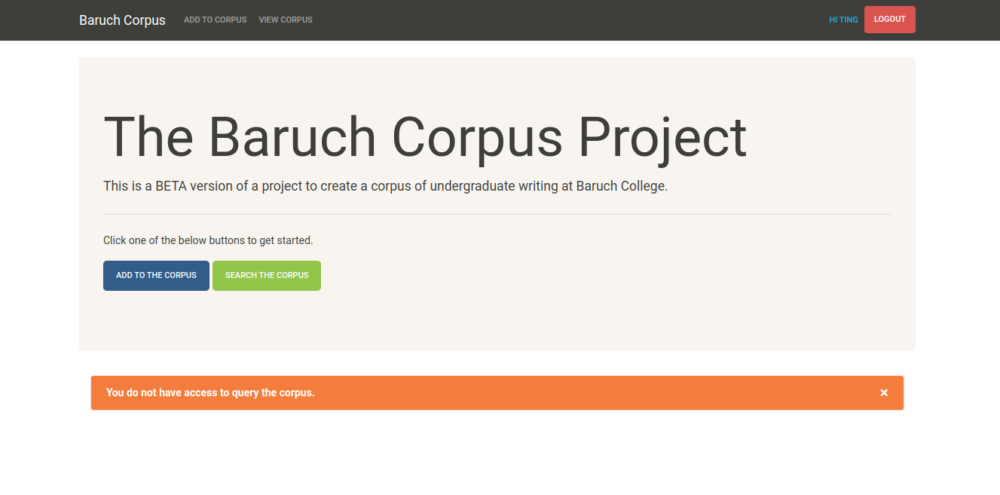
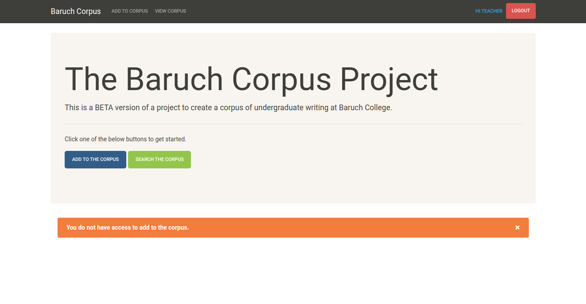
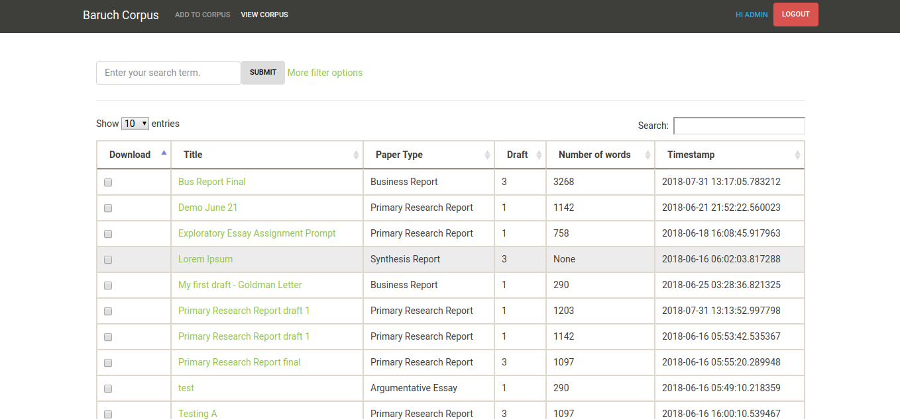

===========
Corpus Tool
===========

:date: 2019-11-01 22:45
:tags: flask, projects, nltk, python
:category: blog
:slug: corpus-tool
:summary: This is a small web application designed to help researchers create a corpus of student writing.

Description
============

Using this tool, students and faculty (with access) would upload student papers to the database; then researchers could download
papers meeting certain criteria in order to create a corpus. (A corpus is a collection of texts that have some commonality; a corpus
is usually used to demonstrate some aspect of language.) The papers uploaded would be passed through a de-identification process so that any
personally identifiable information (such as a student's Name) would be removed. In addition, each paper would be passed through a tagging
process, so that certain characteristics about the writer (e.g. nationality, first language, age range) are associated with the paper.
This would enable a researcher to collect papers meeting specific criteria (e.g. All papers where the author's first language was Russian),
and these papers could then be analyzed.

The code described here is a very early (unfinished) prototype.

This code lives in a `BitBucket repository <https://bitbucket.org/ariesunique/baruchcorpus/src/master/>`_ and is
live on the `Heroku platform <https://corpus-aunique.herokuapp.com/>`_.

How it works
=============

To access the database, users will need a login.

.. image:: ../images/corpus-login.png
   :alt: Corpus login page

There are several levels of access.

* Students can upload their papers to the corpus, but cannot query the corpus (To login use tren:Welcome1).

* Teachers can query the corpus, but cannot upload papers (To login use teacher:teacher).

* Admins can upload papers and perform queries (To login use admin:admin).

|
|

There are two options for adding papers to the corpus. You can add the full text directly into the text field, or you can upload a docx.

When a student uploads a paper, the tool will search the paper for any references to that student's name and will replace these with {{Name}}.
This is a very primitive, first attempt to de-identify the student data. If an admin uploads a paper, then the admin must first select
the name of the student who authored the paper so that the tool knows how to deidentify the student.
The tool will also count the number of words.

|

The proposed workflow for this tool would have been as follows:

|

1. Students upload their papers to the corpus.

.. image:: ../images/corpus-student-upload.png
   :alt: Student upload page

Before a student can use the tool, a login would need to be created for them.
Additionally, the user would need to be associated with the appropriate demographic data, which could potentially be obtained
from the registration office, and bulk-loaded into the system using a sql script.

|
|

2. Researchers/Teachers can query the corpus using demographic data (e.g. find all papers written by first-language Chinese speakers)
   or using words and phrases (e.g. find all papers containing the phrase, "for your consideration").

|
|

3. The researcher can download the text versions of selected papers as a zip file and use a more advanced tool,
   such as `AntConc <https://www.laurenceanthony.net/software/antconc/>`_, to do analysis.

.. image:: ../images/corpus-download.png
   :alt: Student upload page

This is a very early prototype so it does not have all of the functions that the production-ready version would have.
(For example, the query feature is not implemented. Also, we would need to decide exactly what demographic data
we need to collect - country, language, etc. This tool uses a very small set of characteristics.)

|
|

What I Learned
===============

This was a fun project because it was my first time deploying my own project to Heroku. I also had full control over every aspect
of the project, so I had to design the database schema, the UI, configuration options, etc.