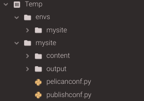
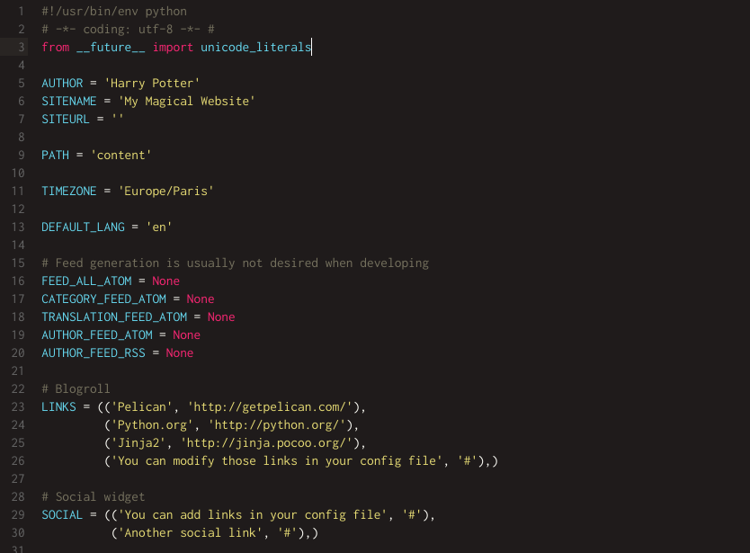
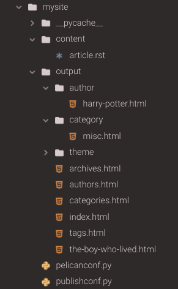
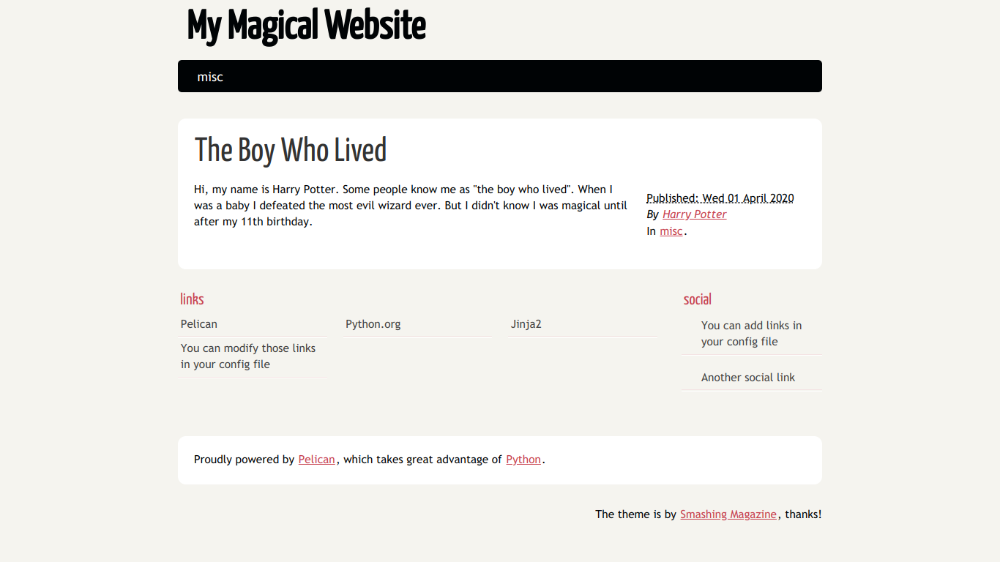

#############################
5 Minute Pelican Quickstart
#############################

:date: 2020-04-03
:tags: pelican
:category: blog
:slug: 5-minute-pelican-quickstart
:summary: This is a really quick and dirty guide to getting started with the pelican static site generator. You can hae a dev site up and running in 5 minutes or less.

.. role:: text-primary
.. role:: text-warning
.. role:: lead

.. |br| raw:: html

        

:lead:`Get started with Pelican in 5 minutes or less. By the end of this post, you will be able to install pelican and generate a very simple site on your local environment.`

.. contents::

|

==================================
:text-primary:`What is Pelican?`
==================================

Pelican_ is a static site generator written in Python. In a nutshell, a static site generator is a library/framework/codebase that generates HTML files using rules specified in config files and content written in some type of markup language. With a static site generator, the HTML files are generated on your local machine, and you push all the files (ie, the entire website) to your web server. To read more about static site generators, `click here <https://davidwalsh.name/introduction-static-site-generators>`_ or `here <https://www.infoworld.com/article/3340827/what-is-a-static-site-generator-static-website-tools-explained.html>`_. There are `many static site generators <https://www.staticgen.com/>`_, but I like Pelican because it is built in Python, which is my language of choice these days. This makes it easy for me to tinker with the underlying code.

=======================================
:text-primary:`How can I get started?`
=======================================

Getting started with Pelican is extremely easy.

Make sure you have a python environment already setup. If you do not, you can easily work in the cloud using `CodeAnywhere <https://codeanywhere.com/>`_  - nothing to install, simply create a free account on CodeAnywhere to get started. Then create a new Container and choose the python stack which already has pip, pyenv, and virtualenv preinstalled (you can choose between Ubuntu or Centos).

|

:text-warning:`1. Create a virtual environment and install pelican`
====================================================================

I like to keep all of my virtual environments in a separate "envs" directory, so that I can easily see how many virtual environments I have on my system. Below are the commands that I ran to set up my virtual environment and install pelican. *Note, that after creating a virtual environment using pip, it is always a good idea to update your pip, as the version in your virtual env might not be the most up-to-date (regardless of the pip version in your main python installation).*

.. code-block:: shell
 
    >> mkdir envs
    >> cd envs
    >> python -m venv mysite
    >> cd ..
    >> source envs/mysite/bin/activate
    >> pip install pip --upgrade
    >> pip install pelican

|

:text-warning:`2. Create a project and quickstart your site`
=============================================================

Pelican comes with a handy command-line tool that will enable you to quickly set up your site by answering a few questions. You will need to create a directory that will house your site and cd into that directory. Then run the "pelican-quickstart" command.

.. code-block:: shell

    >> mkdir mysite
    >> cd mysite
    >> pelican-quickstart
    
For most of these, it is fine to leave the defaults or to simply choose "no". You will learn more about customization later, but for now, our goal is to simply and quickly get a site up and running. The main two items to focus on are: (question 2) *What will be the title of this website?* and (question 3) *Who will be the author of this website?*    

.. code-block:: yaml

    Welcome to pelican-quickstart v4.2.0.
    
    This script will help you create a new Pelican-based website.
    
    Please answer the following questions so this script can generate the files needed by Pelican.
    
    > Where do you want to create your new web site? [.]
    > What will be the title of this web site? My Magical Website
    > Who will be the author of this web site? Harry Potter
    > What will be the default language of this web site? [en]
    > Do you want to specify a URL prefix? e.g., https://example.com   (Y/n) n
    > Do you want to enable article pagination? (Y/n) n
    > What is your time zone? [Europe/Paris]
    > Do you want to generate a tasks.py/Makefile to automate generation and publishing? (Y/n) n
    Done. Your new project is available at /home/cabox/workspace/mysite

|br|
After running pelican-quickstart, your directory structure will look similar to below:

    
|br|
Notice that the command created two empty directories -- **content** and **output** -- and two python files -- **pelicanconf.py** and **publishconf.py**. "content" is where you will write all of your markup. Pelican will grab data from this directory when it is generating your site. All of the files that Pelican generates for your actual website (html, css, etc) will be stored in the "output" directory. The two python files generated specify configuration options for *how* pelican will generate the files. For now, the main one to look at is *pelicanconf.py*.

Below is the generated pelicanconf.py file. You should see some of your responses from the pelican-quickstart command. 
    

    
|

:text-warning:`3. Create some content`
========================================

Pelican enables you to write your content using either `reStructuredText <https://docutils.sourceforge.io/docs/user/rst/quickref.html>`_ or `Markdown <https://www.markdownguide.org/>`_. In order to use Markdown, you will need install the markdown library for python ( *pip install markdown* ). For this example, I will use reStructuredText since it is supported out-of-the-box. Move into the "content" directory. Create a file called *article.rst* and then move back up to the top level directory of your website.

.. code-block:: shell

    >> cd content
    >> vi article.rst
    >> cd ..

Below are sample contents of *article.rst*. You must include a title and a date directive. In this case, the title of this article is "The Boy Who Lived" and it has a data of *2020-04-01*.

.. code-block:: yaml

    The Boy Who Lived
    ==================
    
    :date: 2020-04-01
    
    Hi, my name is Harry Potter. Some people know me as "the boy who lived". When I was a baby, 
    I defeated the most eveil wizard ever. But I didn't know I was magical until after my 11th birthday.
    
|

:text-warning:`4. Generate your output`
==========================================

Now you can run the pelican command to generate the html files for your website. From your top-level directory, run *pelican content*. This tells pelican to look in a directory called "content" for the markup files containing the data for your site (as well as any other static content that might be needed, such as images).

.. code-block:: shell

    >> pelican content
    
After running this command, your directory structure should look similar to below. Notice all of the files that are now in the output directory. 

|br|
Most of these files are "collection" pages that will display various aggregates of your data. For example, the categories page will display a list of categories you have specified and the number of articles in each category. The default category is *misc*, so if you do not specify any categories, all of your articles will be part of the *misc* category.

The file we are most interested is the one that directly corresponds to the article.rst file we provided in the content directory. That file is called *the-boy-who-lived.html*. Notice that the title provided is used to generate a url-safe version of the slug.

|

:text-warning:`5. Preview your site`
=====================================

Now you're ready to see how this looks in your development environment. Move into the output directory and start up a python server. Then navigate to your localhost and view the page. *(Note: If you are using CodeAnywhere, you will need to pass 3000 to the server command to specify the port. So the command will look like ( python -m http.server 3000 ). Additionally, instead of navigating to localhost, you will click on the url of your container which you can find by right-clicking on the container name and choosing Info).*

.. code-block:: shell

    >> cd output
    >> python -m http.server
    

    
|

=======================================
:text-primary:`What's next?`
=======================================
   
Voila! In only a few minutes, you have a full-fledged website running on your local environment. The next things you would want to do are add more content, customize the look and feel of your site, and then deploy it somewhere so your friends and family can view it.
    
.. _Pelican: https://blog.getpelican.com/
