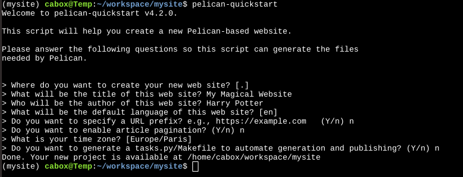
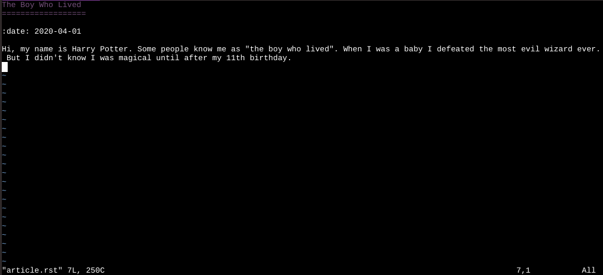

===========================
5 Minute Pelican Quickstart
===========================

:date: 2020-04-03 16:30
:tags: pelican
:category: blog
:slug: 5-minute-pelican-quickstart
:summary: This is a really quick and dirty guide to getting started with the pelican static site generator. You can hae a dev site up and running in 5 minutes or less.

.. role:: text-primary
 
.. role:: lead

.. |br| raw:: html

        

:lead:`Get started with Pelican in 5 minutes or less. By the end of this post, you will be able to install pelican and generate a very simple site on your local environment.`

:text-primary:`What is Pelican?`
---------------------------------

Pelican is a static site generator written in Python. 

:text-primary:`How can I get started?`
-----------------------------------------

Getting started with Pelican is extremely easy.

Make sure you have a python environment already setup. If you do not, you can easily work in the cloud using CloudAnywhere  - nothing to install, simply create a free account on Cloud Anywhere to get started. Create a new Container. Choose the python stack which already has pip, pyenv, and virtualenv preinstalled. You can choose between Ubuntu or Centos.

|

1. **Create a virtual environment and install pelican.** I like to keep all of my virtual environments in a separate "envs" directory, so that I can easily see how many virtual environments I have on my system. Below are the commands that I ran to set up my virtual environment and install pelican. *Note, that after creating a virtual environment using pip, it is always a good idea to update your pip, as the version in your virtual env might not be the most up-to-date (regardless of the pip version in your main python installation).*

.. code-block:: shell
 
    >> mkdir envs
    >> cd envs
    >> python -m venv mysite
    >> cd ..
    >> source envs/mysite/bin/activate
    >> pip install pip --upgrade
    >> pip install pelican

|

2. **Create a project and quickstart your site.** Pelican comes with a handy command-line tool that will enable you to quickly set up your site by answering a few questions. You will need to create a directory that will house your site and cd into that directory. Then run the "pelican-quickstart" command.

.. code-block:: shell

    >> mkdir mysite
    >> cd mysite
    >> pelican-quickstart
    
For most of these, it is fine to leave the defaults or to simply choose "no". You will learn more about customization later, but for now, our goal is to simply and quickly get a site up and running. The main two items to focus on are: (question 2) *What will be the title of this website?* and (question 3) *Who will be the author of this website?*    

|br|
That command will create two empty directories -- content and output -- and create two python files -- pelicanconf.py and publishconf.py. Your directory structure now look similar to below:

.. image:: ../images/pelican-directory-structure-1.png  
    :alt: Pelican directory after quickstart
    
|br|
Below is the generated pelicanconf.py file.
    
.. image:: ../images/pelican-conf-file.png
    :alt: pelicanconf.py
    
|

3. **Create some content.** Pelican enables you to write your content using either reStructuredText or Markdown. In order to use Markdown, you will need install the markdown library for python. For this example, I will use reStructuredText since it is supported out-of-the-box.

.. code-block:: shell

    >> cd content
    >> vi article.rst
    >> cd ..

    
|

4. **Generate your content.**

.. code-block:: shell

    >> pelican content
    
|

5. **Preview your site.**

.. code-block:: shell

    >> cd output
    >> python -m http.server
    
.. image:: ../images/pelican-initial-site-screenshot.png
    :alt: Barebones site
