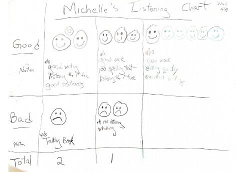
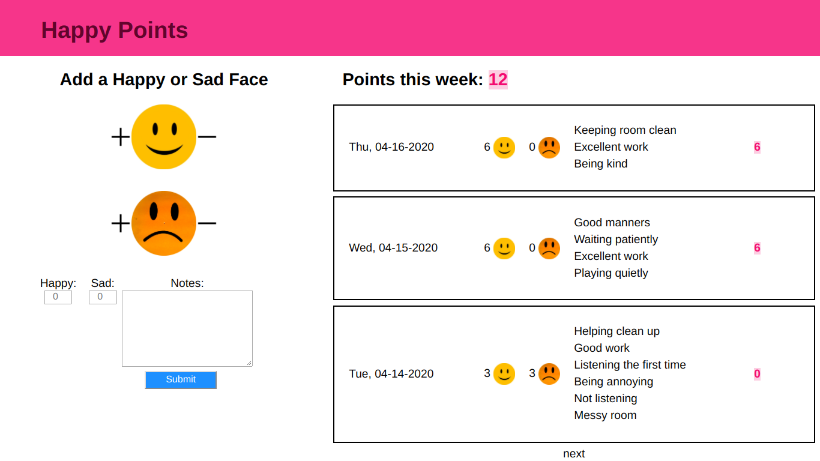

###########################################
Happy Points: A Homeschooling Rewards App
###########################################

:date: 2020-04-29 10:07
:tags: flask, python
:category: blog
:slug: happy-points
:summary: An application to track your child's behavior. The application is built using React on the frontend and Flask on the backend. Guardians can log good and bad behavior as "happy" or "sad" faces, and include notes about the behavior.

.. role:: text-primary
.. role:: text-warning
.. role:: lead

.. |br| raw:: html

        

:lead:`Given the COVID-19 pandemic, I am currently homeschooling my first-grader. To better motivate both of us during this transition, I created a small application to create a rewards system for my daughter.`

**Check out the code on** GitHub_

.. _GitHub: https://github.com/ariesunique/happy_points/

.. contents::

|

==================================
:text-primary:`Summary (TL;DR)`
==================================

The initial aim of this project was to implement a rewards system for my daughter. Good behavior earns a happy face; bad behavior earns a sad face. The total number of points earned on a given day is the difference between happy faces and sad faces. Points are accumulated per week, and can be redeemed throughout the week for various prizes (ie, good behavior earns rewards).

The front-end is written in React (javascript) and the backend is written as a Flask (python) RESTful API.

:text-warning:`You can view the code and try it out yourself from the` `GitHub Repository <https://github.com/ariesunique/happy_points>`_.

|

========================================
:text-primary:`Background (Motivation)`
========================================

Since March 12, I (like many other parents) have been homeschooling my daughter due to novel coronavirus pandemic that has fundamentally changed life as we know it. As of the date that I am writing this, my daughter has been out of school for 6 weeks (but who’s counting).

|br|
My daughter is 6 years old and in first grade. Like most kids her age, she responds well to extrinsic motivation – stickers, candy, etc. The possibility of a potential reward will generally get her to be more focused on the task-at-hand. When she was in school, her teachers used an application called ClassDojo and via the app they would award children “Dojo Points” for good behavior. 

|br|
I realized I needed a similar application if I wanted my daughter to take my “homeschool” seriously. For a few days, I used what I called a “happy face” system – if she did something good, like “staying focused”, I would draw a happy face on a piece of paper. If she did something she knew she wasn’t supposed to do, like being mean to her sister, she would get a sad face on the paper. At the end of the day we would count the happy and sad faces. 

|br|
She responded really well to this system, and this inspired me to turn this into a learning opportunity for myself as well by turning this into an application.

|br|
:lead:`Being a developer, I realized I could use this as the perfect opportunity to build an application that would benefit both me and my daughter!`

|

=========================================================
:text-primary:`Technical Specs and Development Process`
=========================================================

“Happy Faces” is a web application which tracks a child’s behavior using happy faces and sad faces. It is basically the web version of exactly what I was doing on paper. 

|br|
For the web version, I decided to use React on the front-end and a Flask REST server on the backend.

|br|
The React front-end is a single page consisting of two main components. PointsView.js contains a form to enter the number of happy or sad faces and a list of “happy points” accumulated for the week. Points.js renders each entry in the list and consists of a date, the number of happy and sad faces for that day, and a list of notes for that day.

|br|
The backend consists of a REST API written in Flask. The API consists of a single endpoint. I’m using Flask-SqlAlchemy for the ORM, and sqlite for the local database (although if I move this to heroku, I would use postgres).

========================================
:text-primary:`What I Learned`
========================================

This was a fun project to work on. I presented a brief demo of this at the `Recurse Center <https://aiyanabrooks.com/recurse-center.html>`_ (`click here <https://docs.google.com/presentation/d/1QM0Tzeo21AUVCAAQKMsd2T-eQKxw0LWhXybTzy9LUas/edit?usp=sharing>`_ for slides).

Below is a random list of some things I learned/ noticed while working on this.

- This was my first time building anything using React. It was cool to see how components work together.
- I learned a bit about how the "__init__" file works. It took me a minute to understand how to import things. I also think I understand flask blueprints a bit better.
- Did a bit of test-driven development on this project. I attempted to write some test cases first. I'm using pytest.
- I think I wrote pretty good documentation for this. This is my best documented project on GitHub_ to date. I also learned about some nifty online tools for editing markdown, such as `Dillinger <https://dillinger.io/>`_, which provides a preview of your markdown text as you type, and `this tool <https://ecotrust-canada.github.io/markdown-toc/>`_ for generating a table of contents for your GitHub ReadMe.
- Got to use a really nice library called `Moment <https://github.com/zachwill/moment>`_ which makes handling python dates much easier!
