SPELL Attendance Tracker
########################

:date: 2019-10-31 09:20
:tags: projects, flask
:category: blog
:slug: attendance-tracker
:summary: This was my first attempt at creating a Flask application. The goal was to create an online attendance tracking tool that could be used by teachers to store and monitor student attendance.

For a while I was teaching English at a community program called SPELL.
The program required us to turn in paper attendance sheets each week.
For my first Flask project, I wanted to create an online attendance tool for
teachers to more easily track and turn in their attendance. I used Bootstrap for
the UI and mysql for the database. After completing the initial screens,
I decided to refactor the project and start again (see `Take 2`_). Both versions of the code
are written in Python 2.7 which has since been deprecated. This code never went live,
but it was a good learning experience.

Take 1
=======

This code lives in a `Bitbucket repository`_

**/index - This is the index/ Welcome page**

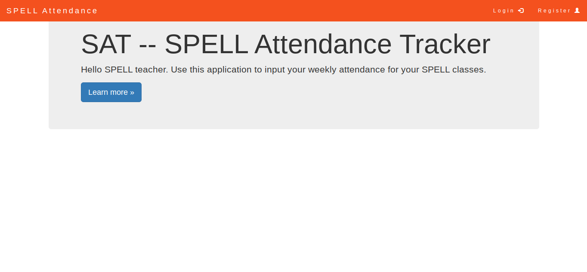

**/register - Enable users to register**

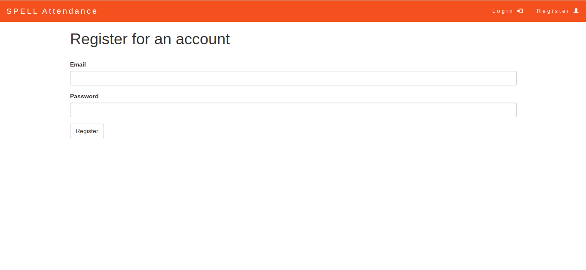

**/login - Standard Login Page**

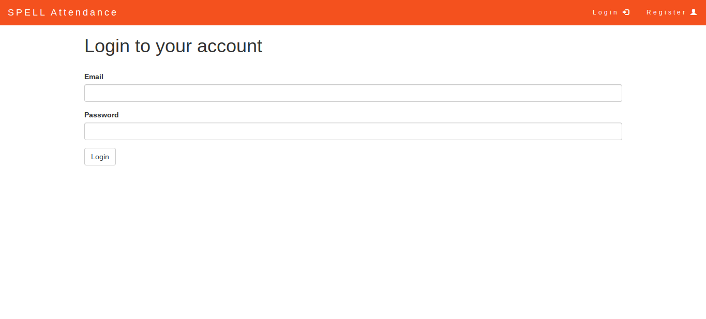

**/login - After a new user registers, he is redirected to the login page.**

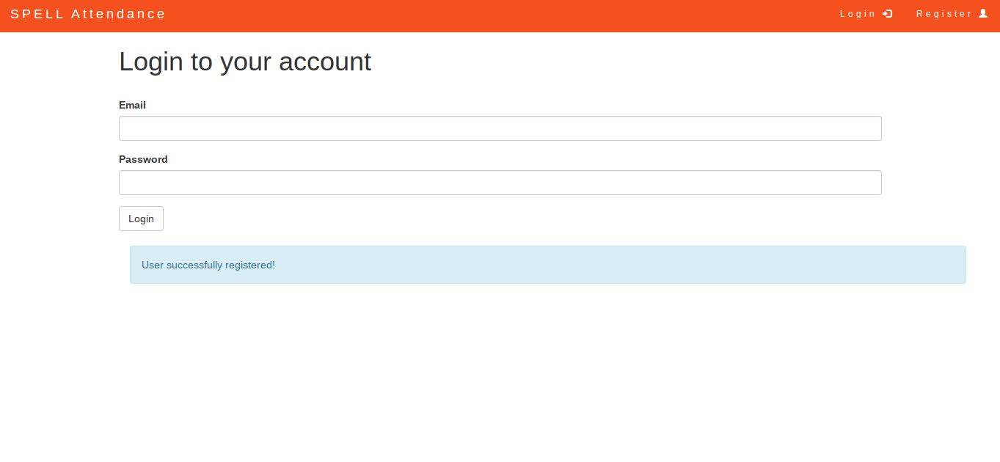

**/dashboard - There was supposed to be more to this screen, but I decided to refactor
the project and start from scratch.**

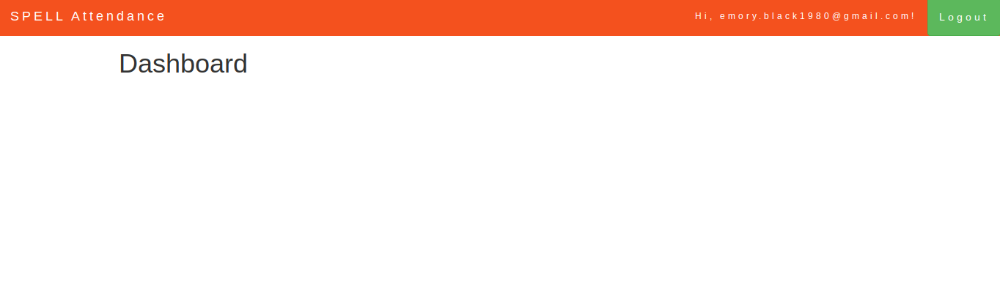

Take 2
=======

This code lives in a BitBucket repository called `SpellDemo <https://bitbucket.org/ariesunique/spelldemo/src>`_
For this second attempt, I used a different Bootstrap theme that was less bright, and I simplified the
code base. In the first attempt, I had tried to use blueprints and the codebase became confusing. This second trial,
I decided it was better to start simple, and refactor later, if needed.

|
|

**/login - Standard Login Page**

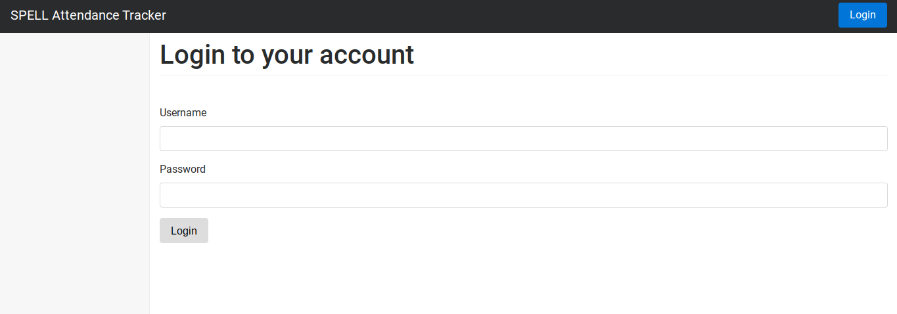

|
|

**/logout redirects back to the Login page with a message to the user that he has successfully logged out**

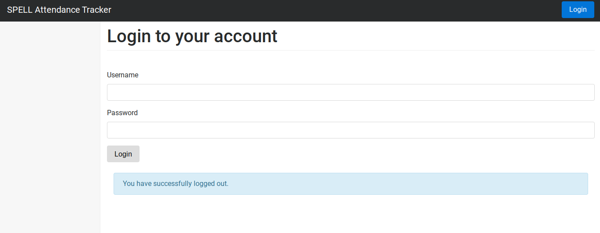

|
|

**/dashboard - Admin dashboard**
SPELL is a community program that recurs twice each year for 12 weeks each semester.
The idea behind this screen is that the administrator of the program would set the current
semester of the program (ie, Winter 2016, Fall 2016), and enter the names of enrolled
students and assign them to classes.

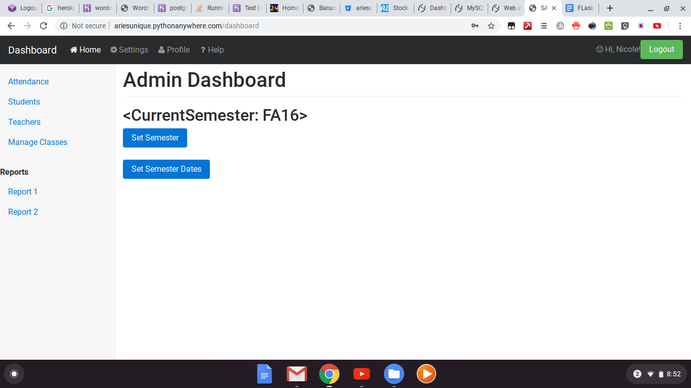

|
|

**/attendance - Morning attendance tab**
Teachers in SPELL teach two classes - one in the morning and one in the afternoon.
This attendance page enables teachers to enter attendance for both their classes.
The page uses javascript and Bootstrap to provide a tab navigation so teacher can easily
toggle between morning and afternoon attendance for that day. The teacher chooses
a date first and is shown a list of all the students in his morning and afternoon classes.
The teacher can use the radio buttons to mark the attendance accordingly, and optionally
can enter a comment.

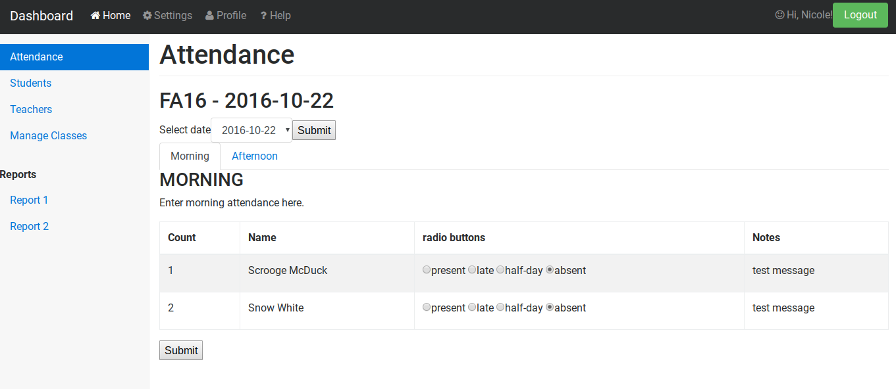

|

**/attendance - Afternoon attendance tab**

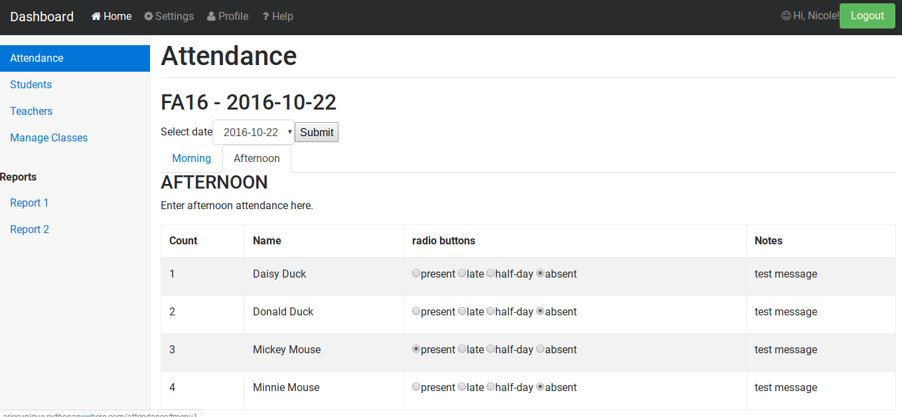

|
|

**/students - List of students in this teacher's class**

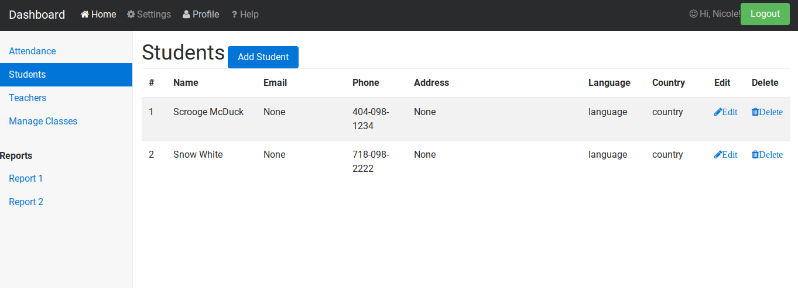

|

**/student/add - Add student**

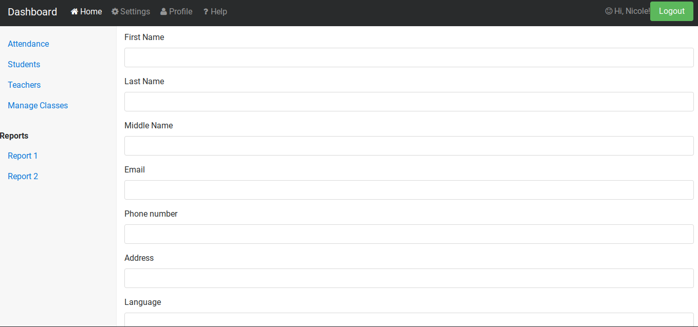

|

**/student/edit/{id} - Edit student**

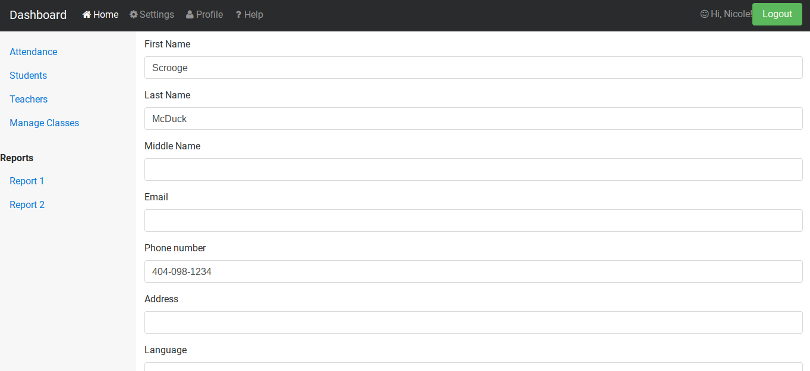

.. _Bitbucket repository: https://bitbucket.org/ariesunique/speller/src/master/